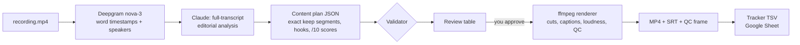

# video-repurposer: build report

**What it is:** a Claude Code skill that turns a long teaching recording into standalone,
captioned LinkedIn clips. Claude makes the editorial calls. A 320-line ffmpeg renderer does
the rest.
**Built:** 3–10 September 2026, 11 commits.
**Status:** working end to end on a real 22-minute recording. A second recording has been
taken as far as an approved-ready plan.

---

## 1. The problem

Cohort sessions and masterclasses run 20–60 minutes. The useful part is a handful of
2-minute arguments buried in housekeeping, tangents and "um". Cutting those by hand takes
hours per recording, and generic AI clippers do it badly on this kind of footage:

- **They cut on silence and keywords, not meaning.** A clip that opens "So, the other
  filters…" is useless to someone scrolling LinkedIn.
- **They crop to vertical.** On a Zoom screen share the slide carries the message, and a
  9:16 crop destroys it.
- **They can't tell a lesson from a story about the presenter's old company.** Teaching
  sessions lean on one running example, and most of those passages don't stand alone.

The goal: from a recording to clips you can publish, with one human decision in the loop
(approve or veto) and no video editor.

## 2. Design

The key design decision is that **the content plan is the only edit decision list**. It is
a JSON file recording, for every clip, which source seconds to keep, plus the hook, the
scores and the verbatim transcript. Everything upstream only writes it. Everything
downstream only reads it. Nothing is ever hand-edited in a video editor, so any clip can
be rebuilt exactly from the plan, and changing a cut means editing one array and
re-rendering that clip.

The split of labour is also deliberate:

| Layer | Who | Why |
|---|---|---|
| What deserves publishing, and where it starts and ends | Claude | Needs judgment |
| Word timestamps, speaker labels | Deepgram | Solved problem, about $0.10 per 22 min |
| Cuts, captions, loudness, fades | ffmpeg | Mechanical, deterministic, free |
| Approve / veto | Human | Cheaper to kill a clip in a table than after upload |

## 3. Features

### Editorial (Claude)
- The whole transcript is analysed before anything is chosen, because arguments that start
  early often pay off late. The written analysis lists candidates **and rejects, with reasons**.
- No fixed clip count: as many as the recording genuinely supports.
- Every clip gets an honest 1–10 score with its reasoning, a hook line, a summary and a
  target audience.
- **Cold-open test:** a clip must make sense from its first word, with no connective
  openings and no references to material it doesn't contain.
- **Running-example rule:** passages narrating the presenter's example company are
  rejected unless a lesson survives with the company deleted.
- **Speaker handling:** other speakers are flagged and generally removed, but an answer is
  never orphaned from its question.

### Cutting
- Boundaries sit on word edges from Deepgram's timestamps. Padding is clamped to the
  surrounding silence, so it never clips the next word.
- Filler and stutters are removed ("um", "uh", "you know", "kind of", "sort of", repeated
  words, and half-word false starts like "con conversions"), but never across a sentence
  boundary.
- Trimming a pause never deletes a whole word, even if the word is left in a sliver of
  audio a fraction of a second long.
- Pauses over 0.7 s are trimmed to 0.25 s.
- A clip can stitch non-adjacent passages together; one clip is built from 27 separate
  segments.
- **Removal cross-check:** the validator fails the plan if a word marked for removal is
  still inside a kept segment.

### Rendering (ffmpeg, `scripts/render_clips.py`)
- A single pass per clip: per-segment trim, then concat, then finishing. The output keeps
  the source's own dimensions, so nothing is cropped or letterboxed.
- **Frame-accurate cuts**, within one frame (0.04 s at 25 fps) of the plan.
- **12 ms audio fades at every seam.** They're inaudible as fades but remove the click a
  hard cut makes in continuous speech.
- **Voice and picture fade in and out.** Video fades in from black over 0.3 s and out over
  0.5 s. Audio fades in over 0.15 s and out over 0.5 s.
- **Two-pass loudness normalisation.** The first pass measures the finished edit. The
  second applies the exact gain, with true peak capped at −1.5 dBTP.
- Encoding: H.264 at CRF 20, AAC at 160 kbps, `+faststart` for instant playback on web.
- Three clips render in parallel, and a single clip can be re-rendered with `--clip`.

### Captions (on by default)
- **Style:** white Inter Bold on a dark box at 78% opacity, low on screen and clear of the
  slide's accent bar. Font, colours, opacity, padding, size and position are all set in
  config.
- **Phrase-aware line breaks:** lines break at commas and before conjunctions, not
  mid-phrase.
- **No dangling words:** a line never ends on "and", "the", "to", "of" and similar, though
  a word that ends a sentence is always fine.
- **Length-aware:** at most 7 words, 4 seconds and 42 characters per line. When a line
  would overflow, it breaks before the overflowing word rather than after it.
- **Orphans folded:** one- or two-word captions merge into a neighbour.
- **No blinking:** gaps under 0.8 s are bridged so the box holds between phrases, and every
  caption stays on screen for at least 0.8 s.
- Timing runs on one continuous timeline across all cuts. An SRT is exported alongside each
  MP4 for platforms that take caption files.

### Built-in QC
- Every clip gets a status line (OK, CHECK or FAIL) covering:
  - duration against the plan (±0.15 s)
  - output loudness and peak
  - caption blinks, orphans and dangling words
- One frame per clip is saved from mid-caption, to eyeball before handing clips over.
- The plan validator checks the schema, cold-open wording, the removal cross-check,
  overlapping segments, the 5-minute cap and the 30-second floor.

### Tracking
- Clip names are numbered in source order (`03 The four ICP filters`). The same string
  names the MP4, the SRT and the tracker row, so they can't drift apart.
- The review table is an 11-column tracker TSV: Video, Clip name, Topic, Summary, Hook,
  Score, Score reasoning, Drive link, Approved, Posted, Transcript. The transcript is
  rebuilt from word data, never retyped.

### Portability
- It's an installable skill that runs from any folder (`VIDEO_REPURPOSER_HOME`), with a
  global API key and a per-recording config override.
- It's **stdlib-only Python 3.9** (no pip, no venv). The only binaries are ffmpeg and
  ffprobe.

## 4. Results

### Test recording
A 22:37 Zoom screen-share masterclass: 1470×920 at 25 fps, one presenter, slides full
frame.

- Claude's analysis found **8 candidate clips**: 7 recommended and 1 flagged as marginal.
  It also rejected **9 passages** in writing, with a reason for each.
- After review, **5 clips went into the final plan**.
- The plan uses **57 kept segments**.

### Final render (re-run for this report, 10 Sep 2026)

| Clip | Runtime | vs plan | Loudness | Captions | QC |
|---|---|---|---|---|---|
| 01 What is an ICP | 83.9 s | +0.08 s | −15.5 LUFS | 37 | OK |
| 02 Why the right ICP converts 4x | 81.4 s | +0.06 s | −15.4 LUFS | 34 | OK |
| 03 The four ICP filters | 217.1 s | +0.13 s | −15.5 LUFS | 104 | OK |
| 04 ICP fill in the blanks | 43.1 s | +0.10 s | −15.8 LUFS | 19 | OK |
| 05 A real ICP example | 146.9 s | +0.10 s | −15.4 LUFS | 63 | OK |

**5/5 clips rendered in 43.6 s, with 0 QC flags.** That's 9.5 minutes of finished video
and 257 captions. Earlier runs, with nothing else competing for the CPU, took about 25–30 s.

### Before and after

| What | Before | After | How it was measured |
|---|---|---|---|
| Loudness | −24.7 LUFS (source) | −15.4 to −15.8 LUFS | ffmpeg `loudnorm` analysis of the source and each output |
| Loudness method | one-pass: −16.2 LUFS | two-pass: −15.5 LUFS | same clip, both methods |
| Caption blinks (gap < 0.8 s) | 17 | 0 | renderer QC report |
| Orphan captions (≤ 2 words) | 2 | 0 | renderer QC report |
| Lines ending on a weak word | 3 | 0 | renderer QC report |
| Longest caption line | 51 chars | ≤ 42 chars | QC report plus frame check |
| Pauses detected | 227 s (bug: counted cuts as pauses) | 21 s (real), then removed | per-clip gap sum |
| Cut accuracy | not measured | ≤ 1 frame | pixel diff (explained below) |
| Clip-to-MP4 path | CapCut drafts plus manual export per clip | one command | — |
| Skill size | +2,650 lines of CapCut glue | 1,379 lines of Python total | `git diff --stat` |

### Second recording
A 22:04 session on market sizing (TAM) went through transcription, analysis and planning
in a separate session:

- Five clips were planned, scored 9, 8, 7, 8 and 7.
- The validator passes the plan, with **three cold-open warnings** (clips that start
  mid-sentence) for review at the approval gate.
- It hasn't been rendered yet. This is the intended behaviour: the gate is where those
  warnings get decided.

## 5. How it was verified

Nothing here is "it looked fine". Each claim above has a check behind it.

- **Frame accuracy.**
  - Method: crop the presenter's camera box (the only region that changes continuously),
    then pixel-diff each output frame at a cut against the source frame at the planned
    timestamp, sweeping offsets to find the best match.
  - Result: the best match landed within one frame.
  - Why this method: an earlier PSNR check returned "?" because it ran with errors
    suppressed. That was caught and replaced rather than reported as a pass.
- **Duration.** Every render compares ffprobe's measured runtime with the plan's sum of
  keep segments and flags anything more than 0.15 s out.
- **Loudness.** Measured on the finished file, which is what the viewer hears, not on the
  filter's own estimate.
- **Captions.** The QC report counts blinks, orphans and dangling words on every render.
  The saved frames are checked by eye.
- **Cold-start tests.** Fresh subagents with no prior context were given only the skill and
  a recording, and told to run it from a clean directory. Those runs **found 15 defects**
  in the instructions and scripts, all fixed.
- **Negative tests.** Plans with deliberately broken fields, such as overlapping segments,
  a wrong `duration_sec`, removed words inside a keep, or a connective opening, were fed to
  the validator to prove it fails them.
- **Score calibration.** The scores were checked against independent viewing: a clip
  scored 6/10 with "kill this first" in its reasoning was judged weak, and a 9/10 was
  judged strong.
- **Commit guards.**
  - Commits that claim a result are chained (`&&`) behind the check that proves it.
  - A repo-wide grep blocks stale references. That guard caught 7 stale comments on its
    first run.

## 6. Timeline

This work was built in a private repository. The public repo starts from the finished
tree, so the hashes below refer to the private history.

| Date | Commit | Change |
|---|---|---|
| 3 Sep | `d1bc461` | Skill created: transcript → scored plan → validator → review table (then rendered through CapCut) |
| 3 Sep | `8d5c4e8` | Pause detection stopped counting cuts as pauses (227 s phantom → 21 s real); pauses actually removed |
| 4 Sep | `722d9d2` | Verbatim transcript column added to the tracker |
| 10 Sep | `237e205` | **Own ffmpeg renderer**: finished MP4s straight from the plan |
| 10 Sep | `e588a3a` | Professional finishing: caption cue rules, two-pass loudness, fades |
| 10 Sep | `e10456c` | Captions on by default; renderer writes its own QC report and frames |
| 10 Sep | `153104b` | Caption fixes found by the first QC run (see lessons) |
| 10 Sep | `11a3cef` | Break before the word that overflows a line |
| 10 Sep | `cb971e6` | **CapCut removed**: −2,650 lines; ffmpeg is the only path |
| 10 Sep | `9be08d5` | Stale pause claim in the docs fixed; the guard now covers the whole skill |

## 7. Lessons, including the mistakes

- **Build the renderer instead of driving an editor.** The first version generated CapCut
  projects by writing its internal JSON files.
  - That worked, but it needed macOS Accessibility permissions to export, broke on app
    updates, couldn't style caption boxes, and left a manual export per clip.
  - About 320 lines of ffmpeg replaced it, and captions and loudness got better, not just
    automated.
- **Make QC part of the tool, not a review step.** The caption rules only became reliable
  once the renderer counted its own defects. The first QC run immediately found problems
  that had passed by eye.
- **A false success claim, caught and corrected.**
  - Commit `153104b` said all five clips were clean. Clip 03 still had an orphan caption,
    because the check ran but the commit didn't depend on it.
  - `11a3cef` fixed the defect, and every later commit was chained behind its check.
- **Silent no-ops are the dangerous failures.** Three bugs had the same shape: a step
  reported success while doing nothing.
  - A PSNR check returned "?" with its errors suppressed.
  - A regex guard matched zero files.
  - A shell loop whose variable didn't word-split printed "moved" while every move failed.
  - The fix each time: verify the effect (the file is gone, the number is real), never the
    exit message.
- **Measure, don't assume the filter did it.** One-pass loudness normalisation reported
  success and delivered −16.2 LUFS. Measuring the output file is what exposed it.
- **Say no to plausible-looking tools.** A popular ffmpeg skill was evaluated and rejected:
  - Its "always `-c copy`" trimming cuts only on keyframes, which would break frame
    accuracy.
  - Its 9:16 presets would crop the slides.

## 8. Honest limits

- **Loudness lands around −15.5 LUFS, not −14.** Zoom audio peaks rule out a clean linear
  gain that large. −15.5 is inside the range social platforms play at, and pushing further
  would mean a limiter colouring the voice.
- **The approval gate hasn't been exercised end to end with a real approval.** Test runs
  were told to stop at the review table.
- **The tracker is paste-in, not API.** The Google Drive connector available here can't
  write spreadsheet cells, so rows come out as TSV.
- **Landscape only, by design.** Screen shares lose their content when cropped to vertical.
- **Transcription is a network call** (Deepgram), chosen over local Whisper because it
  returns speaker labels without a PyTorch stack.
- **No unit-test suite.** Correctness is enforced by the validator, the renderer's own QC
  and the cold-start runs described above, not by pytest.
